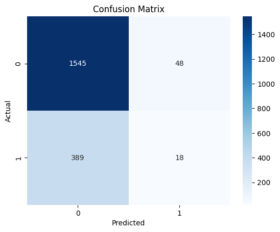
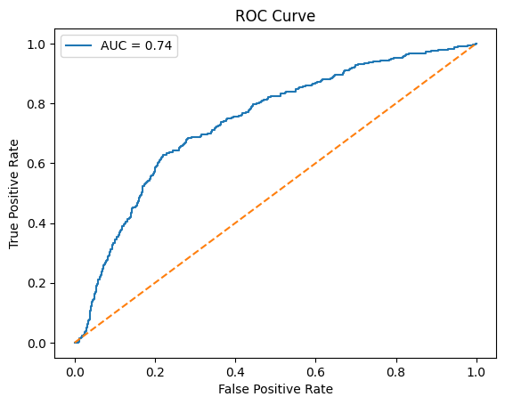

# Logistic Regression for Customer Churn Prediction

This project demonstrates a complete pipeline for binary classification using logistic regression, focused on predicting customer churn based on demographic and behavioral data.

## 📊 Dataset

**Churn for Bank Customers** from Kaggle  
Link: [https://www.kaggle.com/datasets/mathchi/churn-for-bank-customers](https://www.kaggle.com/datasets/mathchi/churn-for-bank-customers)

We use `kagglehub` to automatically download the dataset.

## 🛠️ Tech Stack

- Python 3.x
- Pandas, NumPy
- scikit-learn
- seaborn, matplotlib
- imbalanced-learn (SMOTE)
- kagglehub

## 📌 Features

- Data preprocessing and one-hot encoding
- Logistic regression modeling
- Evaluation using:
  - Accuracy
  - Confusion Matrix
  - Classification Report (Precision, Recall, F1-Score)
  - ROC Curve and AUC
- Coefficient interpretation
- Handling imbalanced data with SMOTE
